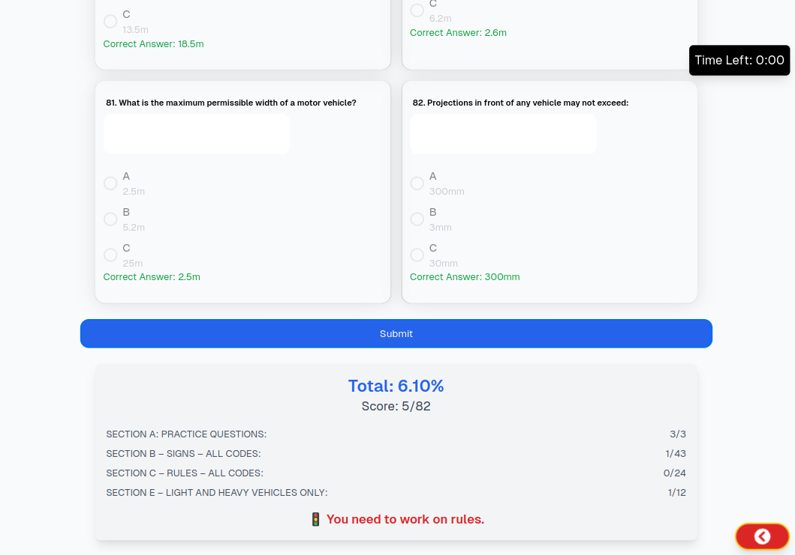

# Namibian Learners License Test Platform

This repository contains the code for an online Namibian Learners License Test platform. This platform helps users prepare for their learner's license by offering practice tests with instant feedback and performance tracking.

## Tech Stack

- **Supabase**: Database, storage, and authentication
- **Next.js**: Client-side framework for a seamless, server-rendered user experience

## Features

- **User Authentication**: Secure login and registration using Supabase Auth
- **Test Selection**: Choose from multiple question sets (Paper A, B, or C) for each license code (1, 2, or 3)
- **Instant Feedback**: Immediate scoring with detailed insights on strengths and areas for improvement

## Screenshots

### Landing Page

### Test View

    
    
    

### Results Page

### Dark Mode

**Dark Mode Landing Page**

**Dark Mode Results Page**

## About

Originally created for personal use, this platform was designed to help anyone in Namibia prepare for their learner's license test. Inspired by plans from regulatory bodies like Natis to develop such a system, I decided to create one to test its feasibility and share it with the community.

---
Most of all it was inspired by a great friend, we were suposed to get our learners licences

---

Thank you for checking out this project, and happy studying!
